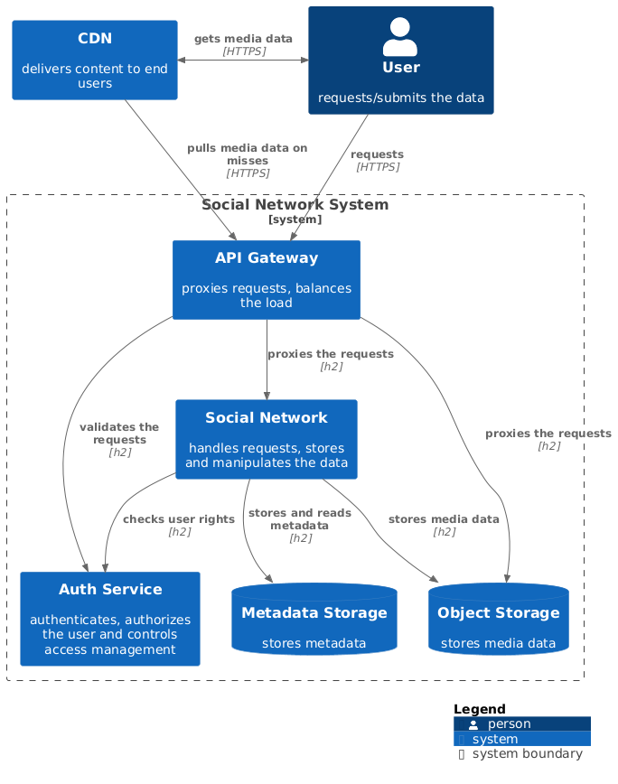
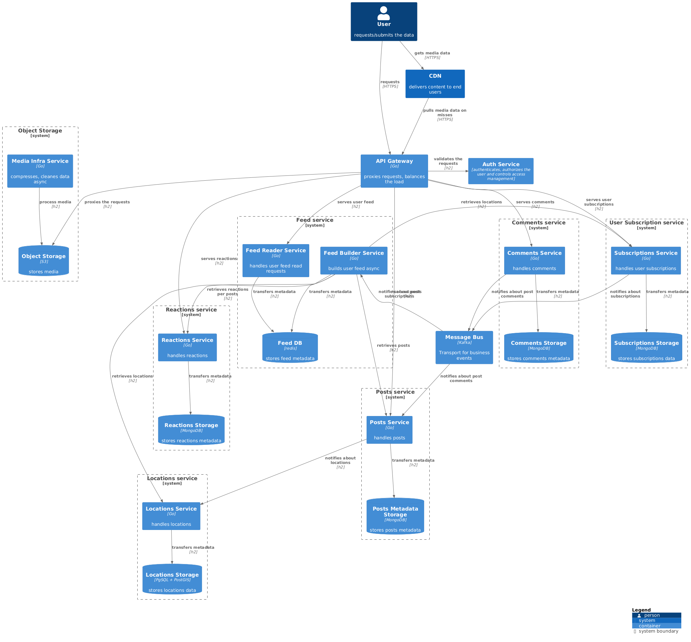

# Social Network - System Design
System Design project for [System Design course](https://balun.courses/courses/system_design)

* **Table of contents:**
    * [Functional & Non-Functional requirements](#requirements)
    * [Load/resources calculations by subsystems](#calculations)
    * [Swagger file](api/rest_api.yml)
    * [Database description](database/README.md)
    * [Distributed storage specs](database)
    * [System design diagrams](#diagrams)

### Functional requirements:

- post publishing from traveling with photos, small description and location
- post reactions and commenting
- subscribing and notifications
- sight search and posts bind to them
- feed with other traveler posts

### Non-functional requirements & Estimates:
- Reliability
- Usability (out of this system design scope)
- Availability (99.95% uptime)
- Scalability
- Linear users grow
- CIS geo region, still huge geo-distribution
- DAU: 10^7 unique users
- Concurrent connections ratio: 0.1
- < 1s average latency for main ops
- peak to average ratio (due to daily phases and seasonality): 10:1
- average post publishing count per day: 1
- 2 images per post in average
- average post reactions per user per day: 10
- average feed reads count per day: 10
- average posts in feed per read: 15
- average post reactions per user per day: 10
- average reaction count per post: 10
- average comments write count per user per day: 5
- average comments reading count per user per day: 10
- average comments batch size per read: 15
- average images per comment: 1

### Calculations:

1. Posts:
   - assumptions:
     - average post publishing count per day: 1
     - average 2 images per post
     - average feed reads count per day: 10
     - average posts in feed per read: 15
   - request size (~2.5 KB metadata + ~1.5 MB images):
     - write:
       - ~~userId: 16 B (uuid)~~ comes with auth
       - text: 2 KB (~1000 chars)
       - location: 48 B ([PostGIS Geometry/Geography](https://stackoverflow.com/questions/30455025/size-of-data-type-geographypoint-4326-in-postgis))
       - images: 2 * 750 KB = 1.5 MB (blob storage)
     - read/feed per post (~2 KB metadata + ~1.5 MB images):
       - userId: 8 B
       - postId: 8 B
       - text: 2 KB
       - location: 48 B
       - createdAt: 8 B
       - images: 2 * 0.75 MB ~ 1.5 MB
   - api/traffic:
     - write
       - RPS: 1e7 * 1 / 86400 ~ 116
       - peak RPS (100:1 ratio): 116 * 10 = 1160
       - traffic: 
         - images: 116 * 1.5 MB = 174 MB/s
         - metadata: 116 * 2.5 KB = 290 KB/s
       - peak traffic: 
         - images: 17.4 GB/s
         - metadata: 29 MB/s
     - read/feed:
       - RPS: 1e7 * 10 / 86400 = 1 157
       - peak RPS: 1157 * 10 = 11570
       - traffic: 
         - images: 1157 * 1.5 MB * 15 = 26.041 GB/s
         - metadata: 1157 * 2.5 KB * 15 = 43.4 MB/s
       - peak traffic: 
         - images: 26.041 GB/s * 10 ~ 260.41 GB/s
         - metadata: 43.4 MB/s * 10 ~ 434 MB/s
   - storage:
     - images:
       - capacity per year: 174 MB/s * 86400 * 365 ~ 5 487 GB
       - Storage options: 
         - SSD NVMe 16 TB:
           - Disks **by Capacity**: 5487.00 TB / 16 TB = **343** disks
           - Disks by IOPS: 12740 IOPS / 10000 IOPS = 2 disks
           - Disks by Throughput: 278.00 GB/s / 3 GB/s = 93 disks
           - Total Disks (maximum of the above): max(**343**, 2, 93) = **343** disks
           - Disks with Replication x3 + 15%: 343 * 3 + 15% = 1183 disks
         - SSD SATA 16 TB:
           - Disks by Capacity: 5487.00 TB / 16 TB = 343 disks
           - Disks by IOPS: 12740 IOPS / 1000 IOPS = 13 disks
           - Disks **by Throughput**: 278.00 GB/s / 0.5 GB/s = **556** disks
           - Total Disks (maximum of the above): max(343, 13, **556**) = **556** disks
           - Disks with Replication x3 + 15%: 556 * 3 + 15% = 1918 disks
         - HDD 2 TB:
           - Disks by Capacity: 5487.00 TB / 2 TB = 2744 disks
           - Disks by IOPS: 12740 IOPS / 100 IOPS = 128 disks
           - Disks **by Throughput**: 278.00 GB/s / 0.1 GB/s = **2780** disks
           - Total Disks (maximum of the above): max(2744, 128, **2780**) = **2780** disks
           - Disks with Replication x3 + 15%: 2780 * 3 + 15% = 9591 disks
       - Total Disks with Replication:
         - **SSD SATA 16 TB: 1918**
       - Hosts calculation (includes replication): 1 host 2 disks
         - total: 1918 / 2 ~ 959
     - metadata:
       - capacity per year: 290 KB/s * 86400 * 365 ~ 9.145 TB
       - Storage options: 
         - SSD NVMe 8 TB:
           - Disks **by Capacity**: 9.14 TB / 8 TB = **2** disks
           - Disks **by IOPS**: 12740 IOPS / 10000 IOPS = **2** disks
           - Disks by Throughput: 0.46 GB/s / 3 GB/s = 1 disks
           - Total Disks (maximum of the above): max(**2**, **2**, 1) = **2** disks
           - Disks with Replication x3 + 15%: 2 * 3 + 15% = 7 disks
         - SSD SATA 1 TB:
           - Disks by Capacity: 9.14 TB / 1 TB = 10 disks
           - Disks **by IOPS**: 12740 IOPS / 1000 IOPS = **13** disks
           - Disks by Throughput: 0.46 GB/s / 0.5 GB/s = 1 disks
           - Total Disks (maximum of the above): max(10, **13**, 1) = **13** disks
           - Disks with Replication x3 + 15%: 13 * 3 + 15% = 45 disks
         - HDD:
           - Disks by Capacity: 9.14 TB / 1 TB = 10 disks
           - Disks **by IOPS**: 12740 IOPS / 100 IOPS = **128** disks
           - Disks by Throughput: 0.46 GB/s / 0.1 GB/s = 5 disks
           - Total Disks (maximum of the above): max(10, **128**, 5) = **128** disks
           - Disks with Replication x3 + 15%: 128 * 3 + 15% = 442 disks
         - Total Disks with Replication:
           - **SSD NVMe 8 TB: 7**
         - Hosts calculation (includes replication): 1 host 2 disks
           - total: 7 / 2 ~ 4
2. Reactions:
   - assumptions:
     - average post reactions per user per day: 10
     - average reaction count per post: 10
   - request size:
     - write ~ 100 B:
       - ~~userId: 16 B~~ comes with auth
       - postId: 16 B
       - reactionType: 8 B
     - read ~ 100 B:
       - userId: 16 B
       - postId: 16 B
       - reactionId: 16 B
       - reactionType: 8 B
       - createdAt: 8 B
   - api/traffic:
     - write:
       - RPS: 10e7 * 10 / 86400 ~ 1 157
       - peak RPS: 1157 * 10 = 11570
       - traffic: 1157 * 100 B ~ 115.7 KB/s
       - peak traffic: ~ 1.157 MB/s
     - read:
       - RPS: 10e7 * 10 / 86400 ~ 1 157 (10 - feed reads count, since reactions are fetched in batch for entire feed)
       - peak RPS: 1157 * 10 = 11570
       - traffic: 1157 * 100 B * 15 * 10 ~ 17.355 MB/s
       - peak traffic: ~ 173.6 MB/s
   - storage:
     - capacity per year: 115.7 KB/s * 86400 * 365 ~ 3.65 TB
     - Storage options: 
       - SSD NVMe 1 TB:
         - Disks **by Capacity**: 3.65 TB / 1 TB = **4** disks
         - Disks by IOPS: 23140 IOPS / 10000 IOPS = 3 disks
         - Disks by Throughput: 0.17 GB/s / 3 GB/s = 1 disks
         - Total Disks (maximum of the above): max(4, 3, 1) = **4** disks
         - Disks with Replication + 15%: 4 * 3 + 15% = 14 disks
       - SSD SATA 1 TB:
         - Disks by Capacity: 3.65 TB / 1 TB = 4 disks
         - Disks **by IOPS**: 23140 IOPS / 1000 IOPS = **24** disks
         - Disks by Throughput: 0.17 GB/s / 0.5 GB/s = 1 disks
         - Total Disks (maximum of the above): max(4, 24, 1) = **24** disks
       - HDD 1 TB:
         - Disks by Capacity: 3.65 TB / 1 TB = 4 disks
         - Disks **by IOPS**: 23140 IOPS / 100 IOPS = **232** disks
         - Disks by Throughput: 0.17 GB/s / 0.1 GB/s = 2 disks
         - Total Disks (maximum of the above): max(4, 232, 2) = **232** disks
         - Disks with Replication + 15%: 232 * 3 + 15% = 800 disks
       - Total Disks with Replication:
         - **SSD NVMe 1 TB: 14**
       - Hosts calculation (includes replication): 1 host 2 disks
         - total: 14 / 2 ~ 7
3. Comments:
   - assumptions:
     - average comments write count per user per day: 5
     - average comments reading count per user per day: 10
     - average comments batch size per read: 15
     - average images per comment: 1
   - request size:
     - write (~0.75 MB images + ~2 KB metadata):
       - text: 1 KB (~500 chars)
       - postId: 8 B (uuid)
       - image: 1 * 750 KB = 0.75 MB (blob storage)
     - read per comment (~0.75 MB images + ~2 KB metadata):
       - text: 1 KB
       - userId: 8 B
       - postId: 8 B
       - commentId: 8 B
       - createdAt: 8 B
       - image: 0.75 MB
   - api/traffic:
     - write:
       - RPS: 1e7 * 5 / 86400 = 580
       - peak RPS: 579.7 * 10 = 5797
       - traffic: 
         - images: 580 * 0.75 MB ~ 435 MB/s
         - metadata: 580 * 2 KB/s ~ 1.16 MB/s
       - peak traffic: 
         - images: 435 MB/s * 10 = 4.35 GB/s
         - metadata: 1.16 MB/s + 10 = 11.6 MB/s
     - read:
       - RPS: 1e7 * 10 / 86400 = 1 157
       - peak RPS: 1157 * 10 = 11570
       - traffic: 
         - images: 1157 * 0.75 MB * 15 ~ 13.016 GB/s
         - metadata: 1157 * 2 KB * 15 ~ 34.71 MB/s
       - peak traffic: 
         - images: 13.016 GB/s * 10 ~ 130.2 GB/s
         - metadata: 34.71 MB/s * 10 ~ 347.1 MB/s
   - storage:
     - images:
       - capacity per year: 435 MB/s * 86400 * 365 ~ 13.718 PB
       - Storage options:
         - SSD NVMe 24 TB:
           - Disks **by Capacity**: 13718.00 TB / 24 TB = **572** disks
           - Disks by IOPS: 17367 IOPS / 10000 IOPS = 2 disks
           - Disks by Throughput: 134.55 GB/s / 3 GB/s = 45 disks
           - Total Disks (maximum of the above): max(572, 2, 45) = **572** disks
           - Disks with Replication + 15%: 572 * 2 + 15% = 1316 disks
         - SSD SATA 24 TB:
           - Disks **by Capacity**: 13718.00 TB / 24 TB = **572** disks
           - Disks by IOPS: 17367 IOPS / 1000 IOPS = 18 disks
           - Disks by Throughput: 134.55 GB/s / 0.5 GB/s = 270 disks
           - Total Disks (maximum of the above): max(572, 18, 270) = **572** disks
           - Disks with Replication + 15%: 572 * 2 + 15% = 1316 disks
         - HDD 16 TB:
           - Disks by Capacity: 13718.00 TB / 16 TB = 858 disks
           - Disks by IOPS: 17367 IOPS / 100 IOPS = 174 disks
           - Disks **by Throughput**: 134.55 GB/s / 0.1 GB/s = **1346** disks
           - Total Disks (maximum of the above): max(858, 174, 1346) = **1346** disks
           - Disks with Replication + 15%: 1346 * 2 + 15% = 3096 disks
         - Total Disks with Replication:
           - **SSD SATA 24 TB: 1316**
         - Hosts calculation (includes replication): 1 host 2 disks
           - total: 1316 / 2 ~ 658
     - metadata:
       - capacity per year: 1.16 MB/s * 86400 * 365 ~ 36.582 TB
       - Storage options:
         - SSD NVMe 8 TB:
           - Disks **by Capacity**: 36.58 TB / 8 TB = **5** disks
           - Disks by IOPS: 17367 IOPS / 10000 IOPS = 2 disks
           - Disks by Throughput: 0.36 GB/s / 3 GB/s = 1 disks
           - Total Disks (maximum of the above): max(5, 2, 1) = **5** disks
           - Disks with Replication x3+ 15%: 5 * 3 + 15% = 18 disks
         - SSD SATA 8 TB:
           - Disks by Capacity: 36.58 TB / 8 TB = 5 disks
           - Disks **by IOPS**: 17367 IOPS / 1000 IOPS = **18** disks
           - Disks by Throughput: 0.36 GB/s / 0.5 GB/s = 1 disks
           - Total Disks (maximum of the above): max(5, 18, 1) = **18** disks
           - Disks with Replication x3 + 15%: 18 * 3 + 15% = 63 disks
         - HDD:
           - Disks by Capacity: 36.58 TB / 1 TB = 37 disks
           - Disks **by IOPS**: 17367 IOPS / 100 IOPS = **174** disks
           - Disks by Throughput: 0.36 GB/s / 0.1 GB/s = 4 disks
           - Total Disks (maximum of the above): max(37, 174, 4) = **174** disks
           - Disks with Replication + 15%: 174 * 2 + 15% = 601 disks
         - Total Disks with Replication:
           - **SSD NVMe 8 TB: 12**: 18
         - Hosts calculation (includes replication): 1 host 2 disks
           - total: 18 / 2 ~ 9

## System design diagrams

Architecture diagrams are built following [C4 model](https://c4model.com/) approach using [C4-PlantUML](https://github.com/plantuml-stdlib/C4-PlantUML).

Context level (C1):

  

Container level (C2):

  

